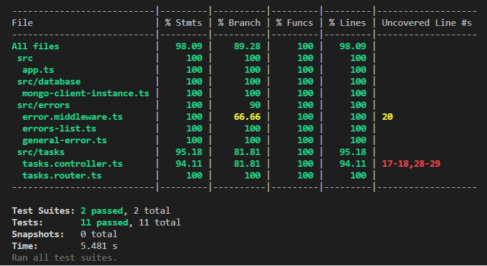
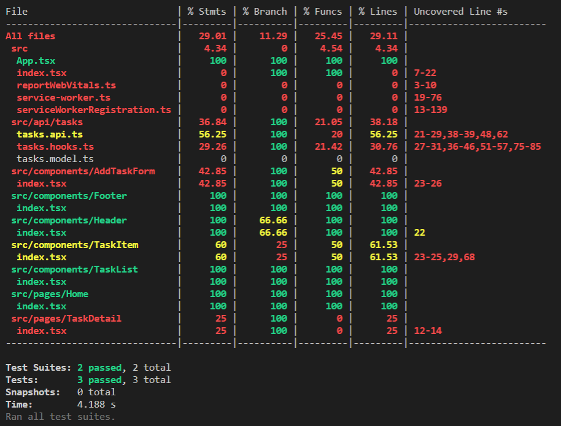

# Technical Proof ISDI Coders

_Time invested: 9h 37m_
The technical test consists of the creation of a TODO App application with the MERN stack.

The technological stack used was:

- **Front-end**: Ionic 6 + ReactJS 17.0 with TypeScript.
- **API**: NodeJS LTS + ExpressJS 4 with TypeScript.
- **DB**: MongoDB 4.
- **Testing**: Jest 27.

The applicación has this main features:

- The user can create, read, update and delete tasks with DDBB persistence

## Repository Structure

A monorepo has been created using NPM workspaces.

It consists of two packages:

- todo-app-backend: NodeJS application with Express that includes a Rest API for task CRUD.
- todo-app-client: ReactJS application with the _Ionic_ extension that, together with _Capacitor_, helps us to create a hybrid application deployable in the markets.

## Backend

One of the remarkable implementations of the API is the use of the singleton design pattern for the DDBB connection pool management.

```ts
// mongo-client-instance.ts
export class MongoClientInstance {
  private static _instance: MongoClientInstance | undefined;
  private _db: Db | undefined;
  private _client: MongoClient | undefined;

  get db(): Db | undefined {
    return MongoClientInstance._instance?._db;
  }
  get client(): MongoClient | undefined {
    return MongoClientInstance._instance?._client;
  }

  public static async getInstance(
    url: string,
    database: string
  ): Promise<MongoClientInstance | null> {
    if (this._instance !== undefined) return this._instance;
    this._instance = new MongoClientInstance();
    try {
      this._instance._client = new MongoClient(url);
      await this._instance._client.connect();
      this._instance._db = this._instance._client.db(database);
      return this._instance;
    } catch (err) {
      console.log(`⚡️[server]: Error al generar el cliente de BBDD ${err}`);
      return null;
    }
  }
}

// index.ts

/**
 * Starts the database pool connection, saving it into the app
 */
MongoClientInstance.getInstance(mongoUri, dbName).then((instance) => {
  app.locals.db = instance?.db;
  app.listen(port, () =>
    console.log(`⚡️[server]: Server listening in port ${port}`)
  );
});
```

Testing has also been included using:

- [Jest](https://jestjs.io/) as framework and test runner
- [@shelf/jest-mongodb](https://www.npmjs.com/package/@shelf/jest-mongodb) for mocking the DDBB
- [supertest](https://www.npmjs.com/package/supertest) for ExpressJS integrated testing

Th current code coverage is:



## Front-end

One of the remarkable implementations of the API is the use of a custom hook for API request management in our components.

```tsx
// tasks.hooks.ts

export const useTasks = (initialTasks: TaskResponse[] = []): TasksHook => {
  const [tasks, updateTasks] = useState(initialTasks);
  const [loading, updateLoading] = useState(true);

  useEffect(() => {
    retrieveAllTasks().then((t) => {
      updateTasks(t);
      updateLoading(false);
    });
  }, []);

  const createTask = (task: BaseTask) => {
    updateLoading(true);
    createTaskAPI(task).then((t) => {
      const createdTask = { ...task, ...t };
      updateTasks([...tasks, createdTask]);
      updateLoading(false);
    });
  };

  const updateTask = (id: string, task: Partial<BaseTask>) => {
    updateLoading(true);
    updateTaskById(id, task).then(() => {
      const i = tasks.findIndex((t) => t._id === id);
      const tasksCopy = [...tasks];
      const updatedTask = {
        ...tasksCopy[i],
        ...task,
      };
      tasksCopy.splice(i, 1, updatedTask);
      updateTasks(tasksCopy);
      updateLoading(false);
    });
  };

  const deleteTask = (id: string) => {
    updateLoading(true);
    deleteTaskById(id).then(() => {
      const i = tasks.findIndex((t) => t._id === id);
      const tasksCopy = [...tasks];
      tasksCopy.splice(i, 1);
      updateTasks(tasksCopy);
      updateLoading(false);
    });
  };

  return {
    tasks,
    loading,
    createTask,
    updateTask,
    deleteTask,
  };
};


// Home/index.tsx
import { useTasks } from '../../api/tasks/tasks.hooks';

const Home: React.FC = () => {
  const { tasks, loading, createTask, deleteTask, updateTask } = useTasks(); // hook for managing the tasks and its operations
  return (
    <IonPage>

```

Although currently the testing coverage is far from the recommended, testing has been included as an example with Jest as test runner and jest-fetch-mock for mock fetch requests.

The current code coverage is:


## Deployment

The application has been deployed using Heroku cloud on the following urls:

- React App: <https://isdi-todo-app-client.herokuapp.com/>
- Api: <https://isdi-todo-app-backend.herokuapp.com>
  - Available endpoints:
    - GET /ping --> API healthcheck
    - GET /tasks --> Retrieves all tasks
    - POST /tasks --> Creates a task. Currently a task could have _name_ and _description_ attributes
    - GET /tasks/:id --> Retrieves a task with that id
    - PATCH /tasks/:id --> Partially updates a task with that id
    - DELETE /tasks/:id --> Deletes a task with that id

## Local setup

Although it is deployed in production, it can be configured to run in a local environment.

### Prerequisites

1. NodeJS v16.x.
2. Git latest version.
3. A mongodb database that can be created in its own cloud called [Atlas](https://www.mongodb.com/es/cloud/atlas/register).

### Starting the project

To do so, the following steps must be performed:

1. Clone the monorepo

   > git clone <https://github.com/agonsant/technical-proof-isdi-coders.git>

2. On root folder run install

   > npm i

3. Create local .env files inside main packages folder

   - Inside todo-app-backend `.env` must declare the following environment vars:

     - _MONGO_URI_: Mongodb connection URL created on prerequisites step 3
     - _DDBB_NAME_: Mongodb name created on prerequisites step 3

   - Inside todo-app-client `.env` must declare the following environment vars:
     - _REACT_APP_BASE_API_=<http://localhost:4000>

4. Now you can start or test each app running the next commands on each packages separately:

   > npm start # starts the application
   > npm test # launch app testing with coverage

## Future improvements

There could be many improvements within the application, listed below are the ones that I would prioritize:

- [Cypress](https://www.cypress.io/) integratión for e2e testing
- Client unitary test coverage over 80%
- [Swagger](https://swagger.io/) integration for API documentation
- Login and register using for example [Firebase Auth](https://firebase.google.com/docs/auth)
- Create more than one list saving it on your private profile
- Share a list using [Web Share API](https://developer.mozilla.org/en-US/docs/Web/API/Web_Share_API)
- Speech a task using [Web Speech API](https://developer.mozilla.org/en-US/docs/Web/API/Web_Speech_API)
- Real time Collaboraton list using [Socket IO](https://socket.io/)
